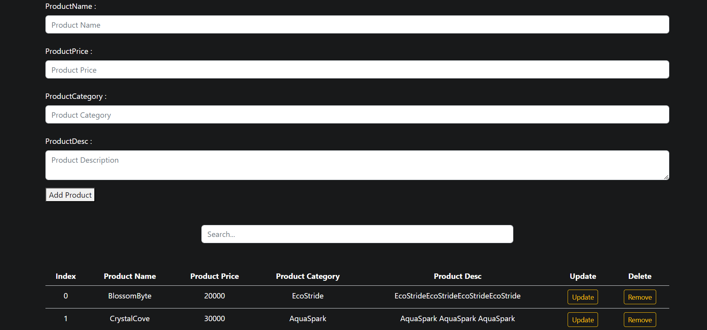

# Product Management Web App

This project is a simple web application for managing a list of products. It provides functionalities for adding, updating, removing, and searching for products. The data is stored in the browser's `localStorage` for persistence.

## Getting Started

## Demo

You can try out the live demo [here](https://moyasser1.github.io/Product-Management-Web-App).

### Prerequisites

- Modern web browser
- Internet connection (for Bootstrap CSS and JS CDN)

### Installation

## Usage
Adding a Product:

Fill in the product details (name, price, category, description).
Click the "Add Product" button.
Updating a Product:

Click the "Update" button next to the product in the table.
Modify the details in the input fields.
Click the "Add Product" button to save the changes.
Removing a Product:

Click the "Remove" button next to the product in the table.
Searching for a Product:

Enter search text in the "Search..." input field.
The table will dynamically update to show matching products.
Local Storage
The application utilizes localStorage to persistently store product data. Products are loaded from localStorage on page load, ensuring data retention across sessions.

Contributing
Feel free to contribute to the project by opening issues or submitting pull requests.

Acknowledgments
Bootstrap - Front-end framework used for styling.
FontAwesome - Icons used for buttons.
